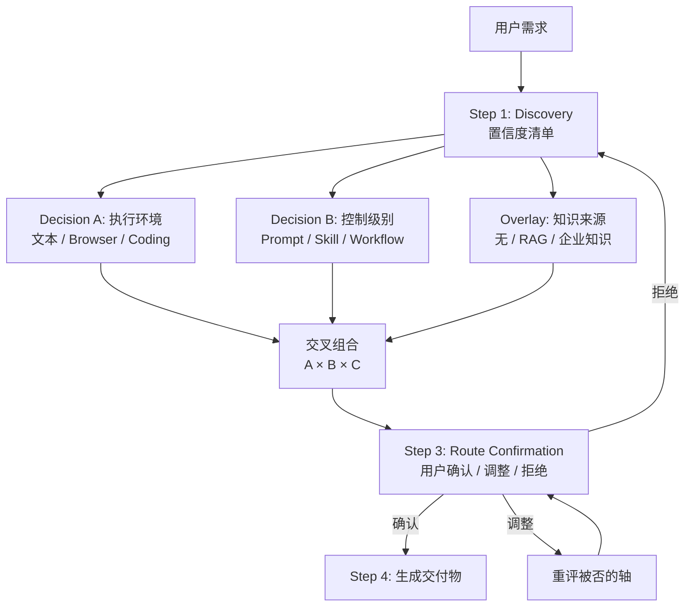

<div align="center">

# AI Solution Router

**帮用户找到最合适的 AI 解决方案——不是六选一，而是三轴独立判断、交叉组合。**

从需求发现开始，不从工具偏好开始。同一个需求可能映射到完全不同的工具，取决于执行环境、控制要求、知识来源和实现难度。

[](https://skills.sh)
[](LICENSE)

```
npx skills add dantezeng001-glitch/ai-solution-router
```

</div>

---

## 核心功能

- **需求发现**：逐个提问直到能做出三轴路由判断，支持快速通道（3/4 维度已知时跳过）
- **三轴决策模型**：执行环境 × 控制级别 × 知识来源，三个独立判断交叉组合出最终路线
- **难度感知**：每条边界内嵌难度门槛——方案越重升级门槛越高，不满足时给出具体降级替代
- **Route Confirmation**：路由结果落地前强制用户确认/调整/拒绝，不再 one-shot
- **升降级触发器**：每条路线附带"什么信号说明该换路线"，推荐完不是结束
- **产出交付**：直接生成对应工件——prompt、skill 文件、workflow 节点图、agent 执行方案

---

## 决策模型



### 难度排序与门槛

| 方案 | 难度 | 升级门槛 |
|---|---|---|
| Prompt | ★ | 无 |
| Browser Agent | ★★ | 需求成立直接上 |
| Skill | ★★★ | ≥ 每月 + 有规则可固化 |
| Coding Agent | ★★★~★★★★ | 有人能验收代码 |
| RAG | ★★★★ | ≥ 每周查询 + 文档持续更新 + 有人维护 |
| Workflow | ★★★★★ | 需要系统集成/审批 + ≥ 每周 + 有人维护 |

---

## 目录结构

```
ai-solution-router/
├── SKILL.md                                  # 主指令文件（5 步 workflow + 三轴决策摘要）
├── agents/
│   └── openai.yaml                           # OpenAI agent 配置
├── test-prompts.json                         # 效果测试用例集
└── references/
    ├── decision-tree.md                      # 三轴决策树 + 难度门槛 + 升降级触发器
    ├── discovery.md                          # 需求发现流程 + 问题池 + Edge Case 处理
    ├── output-templates.md                   # Lightweight / Full 两级输出模板
    ├── skill-creation-guide.md               # Skill 创建指南
    ├── enterprise-knowledge-rag.md           # 企业知识三 Tier 方案（平台中立）
    ├── demo-build-branch.md                  # [可选扩展] Coding Agent 产品 Demo 分支
    └── product-demo-templates.md             # [可选扩展] 产品 Demo 文档模板
```

---

## 使用示例

> **用户**："我有一个重复性的工作，不知道该用什么 AI 工具来解决"
>
> 启动 Discovery → 三轴路由 → Route Confirmation → 生成对应工件。

> **用户**："帮我判断这个需求应该做成 skill 还是 workflow"
>
> 直接进入 Decision B（控制级别），用三道边界判断题区分——AI 是否唯一执行者？需要系统集成吗？跳步会出事吗？

> **用户**："我想做一个产品 demo"
>
> 路由到 Coding Agent → 生成 handoff prompt → 如用户要求继续，加载可选扩展模块 demo-build-branch。

---

## 迭代记录

见 [CHANGELOG.md](CHANGELOG.md)。

---

## 许可证

MIT
