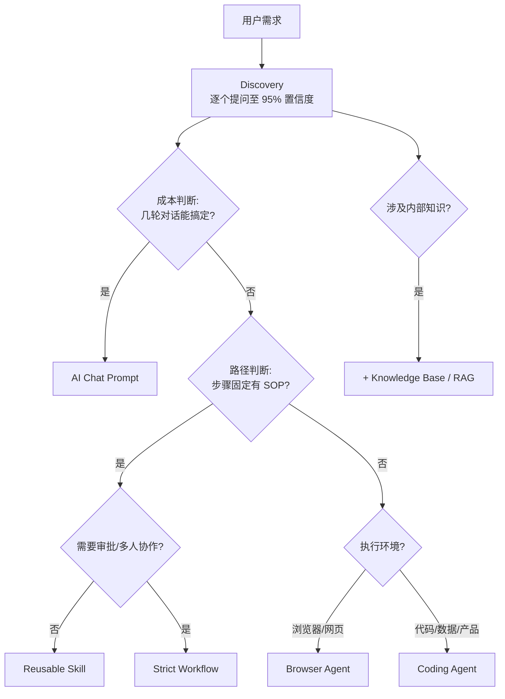

<div align="center">

# AI Solution Router

**帮用户找到最合适的 AI 解决方案：prompt、skill、workflow、browser agent 还是 coding agent。**

从需求发现开始，不从工具偏好开始。同一个需求可能映射到完全不同的工具，取决于复杂度、重复性、执行环境和风险。

[](https://skills.sh)
[](LICENSE)

```
npx skills add dantezeng001-glitch/ai-solution-router
```

</div>

---

## 核心功能

- **需求发现**：逐个提问，达到 95% 置信度后才推荐方案，避免工具先行
- **决策路由**：基于成本、路径固定性、执行环境三维度判断最简可靠方案
- **六种方案类型**：AI Chat prompt / 可复用 Skill / 严格 Workflow / 知识库 RAG / Browser Agent / Coding Agent
- **组合推荐**：单工具优先，仅在多层需求（知识+执行+复用）时推荐组合方案
- **产出交付**：直接生成对应工件——prompt 文本、skill 文件、workflow 节点图、agent 执行方案

---

## 决策流程



---

## 目录结构

```
ai-solution-router/
├── SKILL.md                                  # 主指令文件
├── agents/
│   └── openai.yaml                           # OpenAI agent 配置
└── references/
    ├── decision-tree.md                      # 决策树详细规则
    ├── discovery.md                          # 需求发现流程与问题清单
    ├── output-templates.md                   # 各类方案输出模板
    ├── skill-creation-guide.md               # Skill 创建指南
    ├── enterprise-knowledge-rag.md           # 企业知识库/RAG 方案
    ├── demo-build-branch.md                  # Coding Agent 产品 Demo 分支
    └── product-demo-templates.md             # 产品 Demo 文档模板
```

---

## 使用示例

> **用户**："我有一个重复性的工作，不知道该用什么 AI 工具来解决"
>
> Skill 启动 Discovery 流程，逐个提问理清需求，然后推荐最合适的方案类型并生成对应工件。

> **用户**："帮我判断这个需求应该做成 skill 还是 workflow"
>
> Skill 从决策树的路径判断维度切入，分析步骤固定性和协作需求，给出推荐。

> **用户**："我想做一个产品 demo"
>
> Skill 识别为 Coding Agent 路径，加载 demo-build-branch 和 product-demo-templates 进入产品开发流程。

---

## 迭代记录

见 [CHANGELOG.md](CHANGELOG.md)。

---

## 许可证

MIT
