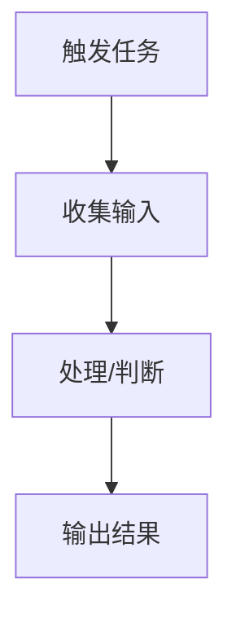

# Product Demo Templates

Use this only inside the demo-build branch. It makes `ai-solution-router` standalone for requirements-to-demo style work.

## Requirement Analysis Templates

### Discovery Opening

```text
我们先从最核心的地方开始：这个需求真正想解决的业务问题是什么？如果 demo 成功了，你希望别人看到它之后相信什么、愿意做什么？
```

Ask one follow-up at a time. Continue until the agent can answer:

- Target user and stakeholders.
- Core business problem.
- Current workflow and workaround.
- Top required capabilities.
- MVP success moment.
- Data inputs and output artifacts.
- External dependencies and mock strategy.
- Human-in-the-loop boundaries.
- Risks, assumptions, and validation plan.

### 01_访谈分析报告

````markdown
# 01_访谈分析报告

## 1. 访谈要点摘要
（语义去噪后的结构化摘要）

## 2. 流程目的与核心意图
### 2.1 为谁提供什么价值
### 2.2 要解决的核心问题
### 2.3 成功标准

## 3. 核心概念、实体与关系
| 概念/实体 | 含义 | 相关对象 | 证据来源 | 不确定性 |

## 4. 主干流程图


## 5. 隐藏关系图
（揭示隐性依赖、信息回流、协作断点、重复劳动根因）

## 6. 深层结构图
（角色、权限、状态机、审批链、职责矩阵等）

## 7. 工作知识图谱
（完成该工作所需知识、技能、工具、经验判断）

## 8. 关键动作分析
| 环节 | 关键动作 | 动作类型 | 工具/协作 | 标准化 | 判断复杂度 | 频次/耗时 | AI替代可能性 |

## 9. AI提效推演
| 当前做法 | AI介入方式 | 预估提效 | 落地前提 | 人工保留点 |

## 10. 模糊表述追问清单
| 序号 | 原文/回答摘录 | 模糊类型 | 为什么要追问 | 建议追问 |
````

### 02_追问补全分析报告

```markdown
# 02_追问补全分析报告

## 1. 置信度结论
- 当前理解置信度：__%
- 可以进入PRD阶段：是/否
- 仍需验证但不阻塞的假设：

## 2. 已补全信息
| 原缺口 | 用户补充 | 对产品方案的影响 |

## 3. 更新后的目标与范围
### 3.1 最终目标
### 3.2 MVP边界
### 3.3 非MVP范围

## 4. 更新后的用户旅程
| 步骤 | 用户动作 | 系统/AI动作 | 输入 | 输出 | 风险 |

## 5. 更新后的关键能力
| 能力 | 解决的问题 | MVP做法 | V2做法 |

## 6. 数据、系统与Mock策略
| 依赖 | 真实对接方式 | Demo阶段Mock方式 | 切换条件 |

## 7. 剩余假设与验证建议
| 假设 | 影响范围 | 最低成本验证方法 |

## 8. 进入下一步的输入包
- 访谈摘要：
- 用户目标：
- MVP定义：
- 核心流程：
- 数据/依赖：
- 成功指标：
```

## Product Plan and PRD Templates

### 产品方案文档

```markdown
# 产品方案文档

## 1. 需求分析
### 1.1 访谈信息解构
| 类别 | 原始信息 | 模糊点 | 补全假设 | 推理依据 |

### 1.2 用户画像
- 典型用户A：
- 典型用户B：

### 1.3 核心场景
| 场景 | 触发条件 | 当前做法 | 目标结果 | 痛点 |

## 2. 业务流程设计
### 2.1 用户旅程地图
| 阶段 | 用户动作 | 工具/协作 | 情绪/阻力 | 机会点 |

### 2.2 主流程、分支流程、异常流程
### 2.3 数据流转逻辑

## 3. 产品功能方案
### 3.1 功能架构
### 3.2 功能清单
| 优先级 | 功能 | 用户价值 | 实现难度 | 版本 |

### 3.3 核心功能详细设计

## 4. 数据架构设计
### 4.1 核心数据模型
### 4.2 数据关系

## 5. 交互与界面设计
### 5.1 页面结构
### 5.2 关键交互

## 6. 技术实现建议
### 6.1 技术选型
### 6.2 开发难点预警

## 7. MVP范围界定
## 8. 验证与迭代
## 9. 成功指标
```

### MVP PRD Rules

- Organize modules by the user's natural action sequence.
- MVP must fit a small demo build unless the user says otherwise.
- Every MVP feature must complete input -> processing -> output -> user value.
- Avoid half-features that need V2 before creating value.
- Every AI capability must define input, output, prompt strategy, confidence/human boundary, and fallback.
- Mark every inferred detail as `【假设】`.
- Include non-goals.

### 产品PRD

````markdown
# [产品名称] MVP PRD
> 基于用户访谈分析自动生成 | 生成日期：[日期]
> 本文档包含 [N] 处基于业务经验的假设，标注为【假设】，需在MVP验证期间确认

---

## 0. 访谈缺失补全

### 0.1 缺口清单与假设
| 序号 | 缺口类型 | 缺口描述 | 假设内容 | 假设依据 | 验证建议 |

### 0.2 补全对PRD的影响说明
（说明哪些假设被推翻后会影响哪些功能、数据或流程）

---

## 1. 产品概述

### 1.1 一句话定位
为[目标用户]提供[核心能力]，解决[核心问题]，替代/优化[当前做法]。

### 1.2 目标用户画像
（角色、团队规模、技能水平、工作节奏、技术接受度）

### 1.3 核心问题与价值主张
| 用户痛点 | 当前将就方案 | 产品解决方式 | 预期提效 |

### 1.4 MVP边界
**做：**

**明确不做：**

---

## 2. 用户旅程地图
| 步骤 | 用户动作 | 当前做法 | 产品方案 | 涉及模块 | 耗时对比 |

---

## 3. 功能需求详述

### 3.1 模块一：[模块名称]【MVP必做】
**功能描述：**

**用户故事：**
- 作为[角色]，我希望[操作]，以便[价值]

**页面线框描述：**
```text
+------------------------------+
| 页面标题                     |
+------------------------------+
| 区域A：内容/输入/状态        |
| 区域B：列表/结果/预览        |
| 按钮：点击后的行为           |
+------------------------------+
```

**输入/输出定义：**
- 输入：
- 输出：

**业务规则：**
- 规则1：
- 规则2：

**验收标准：**
- [ ] 标准1
- [ ] 标准2

---

（每个模块重复上述结构，通常3-5个模块）

## 4. AI能力规格说明书

### 4.1 [AI能力名称]
- **输入规格：** 必填字段、可选字段、上下文数据
- **处理逻辑Prompt要点：** 3-5条核心判断规则
- **输出规格：** 字段、格式、长度、示例骨架
- **置信度与人机边界：** AI自动完成什么，用户必须确认什么
- **降级方案：** AI不可用或输出不可用时的替代流程

---

## 5. 数据架构

### 5.1 核心实体关系
（文本ER图或表格）

### 5.2 关键实体字段定义
**实体：[名称]**
| 字段 | 类型 | 来源 | 必填 | 说明 |

### 5.3 与现有系统的同步方案
（MVP优先CSV/Excel导入导出或Mock API；V2再做真实API集成）

---

## 6. MVP验证计划

### 6.1 成功指标
| 指标类别 | 指标名称 | 基线值 | MVP目标值 | 测量方式 |

### 6.2 验证周期与方法
（时间安排、测试用户数、数据采集方式）

### 6.3 迭代判定规则
- 继续迭代的条件：
- 需要 pivot 的信号：

---

## 7. 技术方案建议

### 7.1 技术选型
| 层级 | 推荐方案 | 选择理由 |

### 7.2 成本估算
（服务器、AI调用、第三方数据源、人工运营）

### 7.3 风险清单
| 风险 | 影响 | 概率 | 应对方案 |

---

## 8. 版本路线图
| 版本 | 周期 | 核心目标 | 包含功能 |
| MVP | 4周 | ... | ... |
| V1.1 | +4周 | ... | ... |
| V2 | +8周 | ... | ... |
````

## Technical Delivery Templates

### Technical Defaults

Use existing project conventions first. For greenfield demos, prefer:

- Frontend: Vite/React or simple Next.js only when routing/server features matter.
- Backend: single-process Node/Express, FastAPI, or framework-native API routes.
- Database: SQLite, local JSON, or in-memory store for demos.
- AI: mock LLM endpoint by default, with a future real provider adapter.
- Files: local `DEMO_DATA/` samples and local uploads.
- Config: `.env` with `USE_MOCK=true` by default.

### TECH_DESIGN.md

````markdown
# TECH_DESIGN

## 1. System Overview
（Mermaid or ASCII module/data-flow diagram）

## 2. Tech Stack
| Layer | Choice | Reason | Local setup impact |

## 3. Module Breakdown
（frontend, backend, data, mock services, AI adapters, sample data）

## 4. Directory Structure
```text
project/
  src/
  mock/
  DEMO_DATA/
  docs/
```

## 5. Core Data Model
| Entity | Fields | Source | Stored where |

## 6. Key Business Sequence
（sequence diagram or numbered flow）

## 7. Dependency List
| Dependency | Real or Mock | Why | Switch plan |

## 8. Run Commands
（Windows and Mac compatible where possible）
````

### MOCK_SERVICES.md

```markdown
# MOCK_SERVICES

## 1. Mock Strategy
- Default mode: `USE_MOCK=true`
- All external systems, AI calls, auth, messages, file storage, and payment-like services are mocked unless verified.

## 2. Mock Endpoints
| Service | Endpoint | Method | Request | Response | Data source |

## 3. LLM Mock Behavior
Return structured JSON plus a short natural-language summary that looks realistic.

## 4. Switching to Real Services
| Mock | Required real credentials/docs | Env vars | Regression tests |
```

### FUTURE_INTEGRATION.md

```markdown
# FUTURE_INTEGRATION

| Mocked dependency | Real owner/system | Needed from owner | Switch steps | Risks | Fallback |
```

### ACCEPTANCE.md

```markdown
# ACCEPTANCE

## 1. Acceptance Cases
| Case | Preconditions | Steps | Expected result |

## 2. End-to-End Demo Path
（Must cover mock mode, sample data, and final output）

## 3. Demo Script
（3-5 minute narration plus exact clicks/commands）

## 4. Verification Log
| Check | Command/action | Result |
```

### README.md

README must include:

- What this demo does.
- Prerequisites.
- Install/run commands.
- How to use sample data.
- Demo path.
- Mock/real mode switch.
- Troubleshooting.

### DEMO_DATA/

Create sample data whenever the product expects uploads, imports, seeded records, or realistic examples.

Minimum contents:

- `DEMO_DATA/README.md`: what each file is for, demo path, and field rules.
- `sample_*.csv` or `sample_*.xlsx`: 20-50 realistic rows when tabular data is needed.
- `sample_*.pdf` or images when document/image processing is demonstrated.
- Seed JSON when APIs or local state need starting records.

## External Dependency Rules

Mock these by default:

- CRM, ERP, HR, internal admin systems, approval systems.
- LLM/AI providers when the product involves smart analysis, summary, recommendation, classification, or intent recognition.
- File storage, email, SMS, push, payment, login, OAuth, maps, analytics, search, and third-party APIs.
- Human approval flows that would block demo completion.

For every mock:

- Use meaningful business data.
- Provide request/response examples.
- Make failure and empty states testable.
- Include a future real-integration switch plan.
